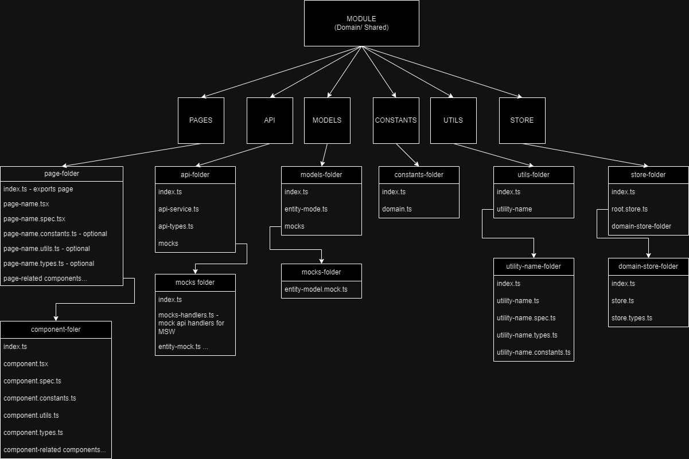
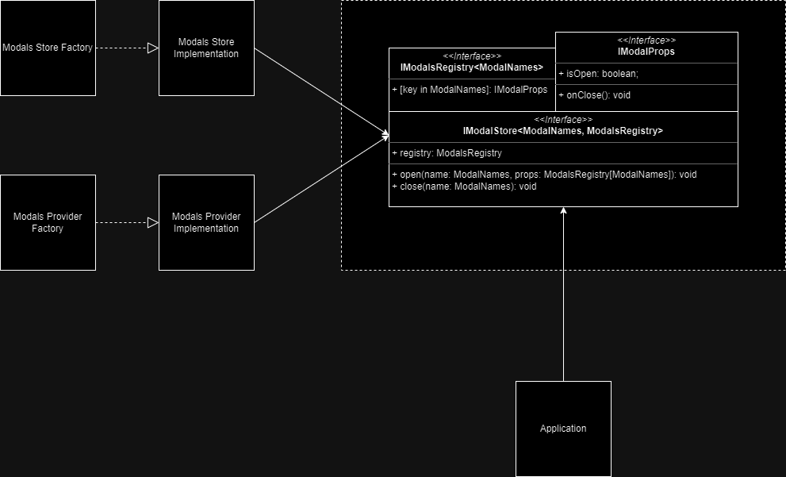

Application for creating and managing packages.
There are 3 types of users:
- Admin
- Manager
- Client

Currently, application supports only Admin users.

**Technologies used:**
- React
- MobX
- Typescript
- Webpack
- Jest
- Testing Library
- Material UI
- Mock Service Worker
- Eslint
- Prettier

**Technical moments:**
- custom http service
- modular architecture to be done

Project Structure
```
├── to be done
```

## Run application

Run locally
```bash 
npm run dev
```

Run locally with mocked api
```bash 
npm run dev:mock
```

Run tests
```bash 
npm run test
```

Check linter
```bash 
npm run lint
```

Fix linter 
```bash 
npm run lint:fix
```

**Module Dependencies:**


**Project Structure:**


**Modals Architecture:**

